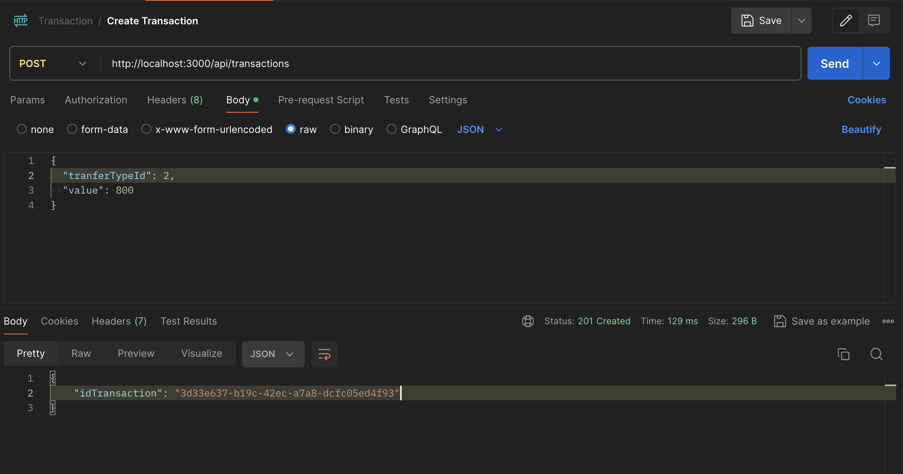
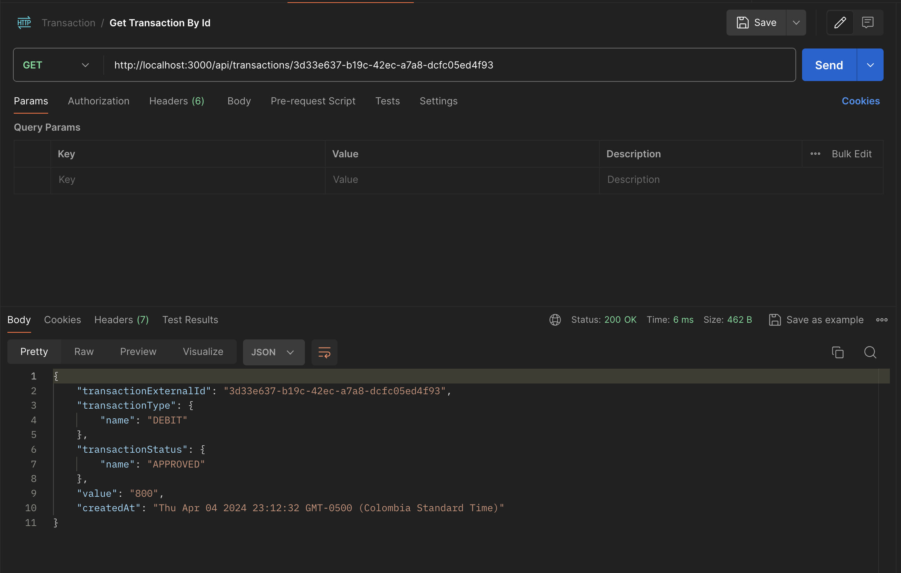
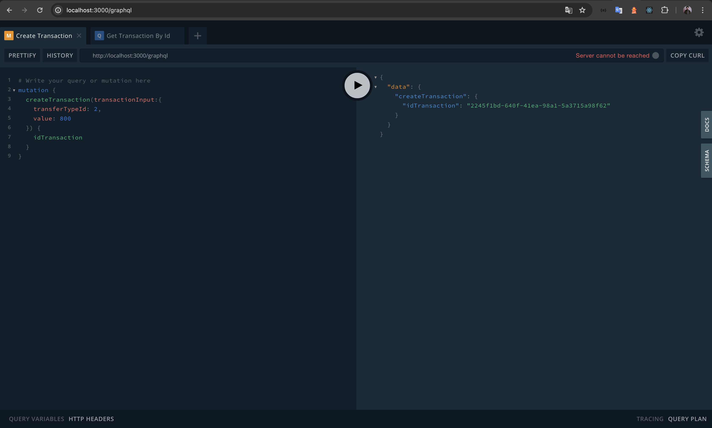
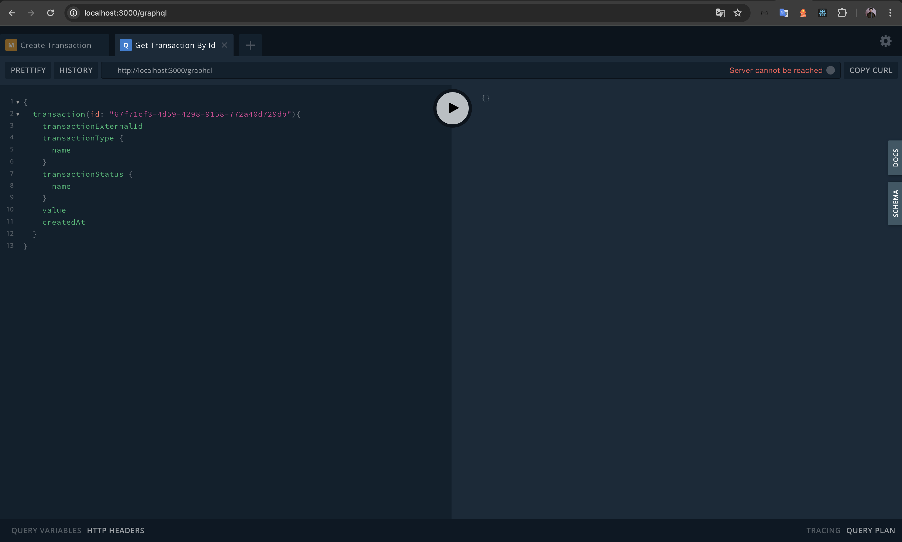

## Instructions

1. Execute docker-compose.yml and wait for the resources to be uploaded with the command **docker-compose up**.
2. Compile the migration file for database creation in postgresql at the following address: **./transaction/src/database/migrations/*-init.ts** with the following command **npm run migrations:run**.
3. Compile microservice transaction with the following command **npm run start:dev**.
4. Compile anti-fraud microservice with the same command seen above **npm run start:dev**.
5. Make requests for **transaction creation** as of **query by transactionId**.

### Rest API

### GraphQL

Thank's a lot :)